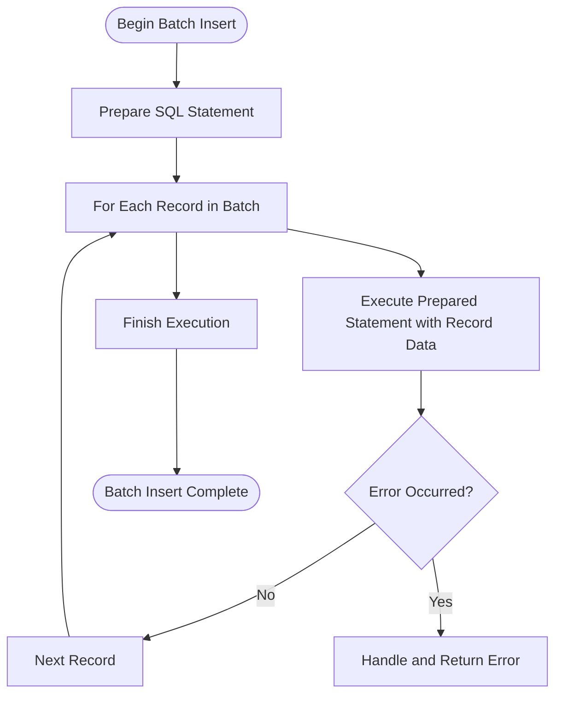

# Batch Inserts and Performance Patterns

This guide provides practical best practices for performing batch inserts using GORM with ClickHouse. It also covers performance optimization strategies and important considerations to avoid common issues when handling large volumes of data. By following this guide, you will streamline your data ingestion workflows, reduce latency, and ensure efficient database operations.

---

## 1. Understanding Batch Inserts with GORM and ClickHouse

### What This Guide Helps You Achieve
Learn how to efficiently perform bulk inserts using the GORM ClickHouse driver, optimize data throughput, and handle large datasets gracefully.

### Prerequisites
- A working Go environment with [GORM ClickHouse driver](https://github.com/go-gorm/clickhouse) installed.
- A running ClickHouse server accessible to your application.
- Basic knowledge of GORM CRUD operations (see [Basic CRUD Operations guide](/guides/getting-started/basic-crud)).

### Expected Outcome
- Insert multiple records efficiently in batches
- Understand how GORM internally handles batch inserts with prepared statements
- Recognize performance trade-offs and how to structure your batch size
- Avoid common pitfalls like transaction size limits and connection overhead

### Estimated Time
15 to 30 minutes to grasp core concepts and run sample batch inserts.

### Difficulty Level
Beginner to Intermediate

---

## 2. Performing Batch Inserts Step-by-Step

Batch inserts are critical when working with large volumes of records to minimize overhead and maximize throughput.

### Step 1: Prepare Your Data Slice
Define a slice of your data model instances to insert.

```go
users := []User{
    {ID: 11, Name: "batch_create_1", FirstName: "zhang", LastName: "jinzhu", Age: 18, Active: true, Salary: 6},
    {ID: 12, Name: "batch_create_2", FirstName: "zhang", LastName: "jinzhu", Age: 18, Active: false, Salary: 6.12},
    {ID: 13, Name: "batch_create_3", FirstName: "zhang", LastName: "jinzhu", Age: 18, Active: true, Salary: 6.1234},
    {ID: 14, Name: "batch_create_4", FirstName: "zhang", LastName: "jinzhu", Age: 18, Active: false, Salary: 6.123456},
}
```

### Step 2: Use `Create` to Insert the Batch
Pass the entire slice to GORM's `Create` method in a single call.

```go
if err := DB.Create(&users).Error; err != nil {
    log.Fatalf("failed to create users in batch, error: %v", err)
}
```

#### Expected Result
- All records in `users` are inserted using prepared statements to optimize execution.
- Minimal network round-trips due to statement reuse by GORM.

### Step 3: Verify Inserted Records

Query inserted records to confirm correctness:

```go
var results []User
if err := DB.Find(&results).Error; err != nil {
    log.Fatalf("failed to query users after batch insert, error: %v", err)
}
// Use your preferred assertion or validation method here
```

---

## 3. Performance Optimization Tips

### Use Prepared Statements Internally
GORM with ClickHouse driver automatically prepares and reuses statements for batch inserts which reduces overhead.

### Choose Appropriate Batch Size
- Keep batch sizes moderate (e.g., 100-1000 records per insert) to prevent memory exhaustion or ClickHouse errors.
- Too large batches may cause timeout errors or overload ClickHouse server resources.

### Avoid Large Transaction Sizes
Although ClickHouse is optimized for bulk operations, extremely large inserts wrapped in a single transaction can degrade performance. Break large import jobs into manageable chunks.

### Use Connection Pooling
Configure your GORM connection to leverage Go SQL connection pooling to maintain performance during high insert loads.

---

## 4. Common Pitfalls and How to Avoid Them

<AccordionGroup title="Common Batch Insert Challenges">
<Accordion title="Issue: Incomplete Batch Insert or Errors During Insert">
Usually caused by exceeding write timeouts or server limits. To mitigate:
- Reduce batch size
- Check ClickHouse server logs for errors
- Use connection options to increase timeouts
</Accordion>
<Accordion title="Issue: Lost Data Due to Lack of Transaction Commit">
ClickHouse operates differently from transactional DBs. Ensure your batch insert logic handles errors carefully and retries if necessary.
</Accordion>
<Accordion title="Issue: Schema Mismatches Causing Insert Failures">
If your data structure evolves, ensure migrations are run (see [Running Migrations guide](/guides/getting-started/running-migrations)) before batch inserting data.
</Accordion>
</AccordionGroup>

---

## 5. Advanced Usage and Examples

### Inserting Using a Map for Partial Columns
You can perform inserts via a map if you don’t have a full struct instance.

```go
userMap := map[string]interface{}{
    "id": 122, "name": "create2", "first_name": "zhang", "last_name": "jinzhu", "age": 18, "active": true, "salary": 6.6666,
}

err := DB.Table("users").Create(&userMap).Error
if err != nil {
    log.Fatalf("failed to create user with map, error: %v", err)
}
```

### Illustration: Internal Prepared Statement Execution Flow


---

## 6. Troubleshooting

### Problem: Batch Insert Returns Timeout or Deadline Exceeded
- Check network latency between app and ClickHouse.
- Reduce batch size.
- Tune driver connection timeouts if possible.

### Problem: Inserted Data Missing or Partial
- Verify no silent errors were ignored in `Error` returns.
- Confirm schema matches inserted data fields.
- Check if table engine or constraints affect inserts.

### Problem: Performance Problems Under High Load
- Scale batch insert size down.
- Use multiple goroutines to parallelize smaller batches.
- Monitor ClickHouse server resource utilization.

<Note>
Enable `DB = DB.Debug()` during development to see generated SQL and driver internals for diagnosis.
</Note>

---

## 7. Summary and Next Steps

### What You Have Learned
- How to perform batch inserts using `DB.Create(&slice)` effectively with GORM and ClickHouse.
- Key practices to optimize throughput and avoid downtime or resource exhaustion.
- How to verify successful inserts and debug common issues.

### Where to Go Next
- Explore [Database Migrations and Table Options](/guides/getting-started/running-migrations) to evolve schemas safely.
- Consult [Advanced Configuration Options](/guides/advanced-usage/advanced-configuration-options) to fine-tune driver performance.
- Use [Basic CRUD Operations](/guides/getting-started/basic-crud) to master other data manipulations.

---

## Appendix: Complete Batch Insert Test Example

```go
func TestBatchCreate(t *testing.T) {
    users := []User{
        {ID: 11, Name: "batch_create_1", FirstName: "zhang", LastName: "jinzhu", Age: 18, Active: true, Salary: 6},
        {ID: 12, Name: "batch_create_2", FirstName: "zhang", LastName: "jinzhu", Age: 18, Active: false, Salary: 6.12},
        {ID: 13, Name: "batch_create_3", FirstName: "zhang", LastName: "jinzhu", Age: 18, Active: true, Salary: 6.1234},
        {ID: 14, Name: "batch_create_4", FirstName: "zhang", LastName: "jinzhu", Age: 18, Active: false, Salary: 6.123456},
    }

    if err := DB.Create(&users).Error; err != nil {
        t.Fatalf("failed to create users, got error %v", err)
    }

    var results []User
    DB.Find(&results)

    for _, u := range users {
        var result User
        if err := DB.Find(&result, u.ID).Error; err != nil {
            t.Fatalf("failed to query user, got error %v", err)
        }

        if result.Name != u.Name {
            t.Errorf("mismatch after batch insert, expected %v, got %v", u.Name, result.Name)
        }
    }
}
```

---

By following these guidelines and examples, you will efficiently batch insert data into ClickHouse with GORM, ensuring high performance and reliability for analytical workloads.


---