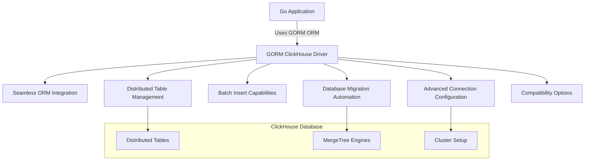

# Feature Overview

Unlock the full potential of ClickHouse in your Go applications with the GORM ClickHouse driver. This page highlights the core features tailored to seamlessly mesh with GORM’s ORM capabilities while maximizing ClickHouse’s analytic and scalable database strengths. Whether managing distributed data, optimizing batch inserts, or automating migrations, these features streamline your development workflow and accelerate time to insight.

---

## Seamless GORM Integration

The GORM ClickHouse driver bridges the high-performance ClickHouse database with the intuitive and familiar GORM ORM framework for Go developers. This tight integration means you can:

- Use idiomatic Go structures and GORM conventions to define schema, queries, and transactions without sacrificing ClickHouse power.
- Leverage standard GORM methods (`AutoMigrate`, `Create`, `Find`, `Update`) with ClickHouse-aware optimizations.
- Benefit from automatic SQL dialect adaptation for ClickHouse, enabling a frictionless developer experience.

**Example:**
```go
// Auto Migrate your User model directly to a ClickHouse table
db.AutoMigrate(&User{})

// Perform batch insert using GORM's familiar API
users := []User{{Name: "Alice"}, {Name: "Bob"}}
db.Create(&users)
```

This integration reduces the learning curve and keeps your application code clean and maintainable.

---

## Distributed Table Support

ClickHouse excels in distributed analytical workloads. The driver supports distributed table creation and management, allowing your Go applications to:

- Define tables spanning multiple ClickHouse nodes or clusters.
- Automatically pass cluster options and table engine directives through GORM migration commands.
- Enable cluster-wide configurations, making it easier to scale horizontally and handle large datasets efficiently.

**How it Helps:**

Managing distributed tables usually requires explicit SQL statements. With the GORM ClickHouse driver, you set cluster and engine options via simple GORM settings, such as:

```go
// Set distributed engine options
db.Set("gorm:table_cluster_options", "ON CLUSTER default")
  .Set("gorm:table_options", "ENGINE=Distributed(cluster, default, users)")
  .AutoMigrate(&User{})
```

This simplifies scaling your database schema across nodes without leaving your Go code.

---

## Batch Insert Capability

Insert multiple records efficiently with built-in support for batch inserts. This feature dramatically improves write throughput and reduces latency for bulk data operations common in analytics and ETL tasks.

**Benefits:**

- Fewer round-trips to the database.
- Utilizes ClickHouse's fast inserting mechanisms.
- Maintains GORM's elegant API for inserting collections.

**Example:**
```go
users := []User{{Name: "Eve"}, {Name: "Mallory"}, {Name: "Trent"}}
db.Create(&users)   // inserts all users in a single batch operation
```

Batch insert is essential for time-series, event logging, and large-scale data ingestion applications.

---

## Database Migration Support

Automate schema management with migration features that respect ClickHouse’s unique capabilities and constraints:

- Auto-migrate Go models to ClickHouse tables, including columns, indexes, and constraints where supported.
- Support for adding, dropping, and altering columns using `ALTER TABLE` statements compatible with different ClickHouse versions.
- Handle table comments, default values, TTL, and column compression codecs.
- Awareness of ClickHouse version differences; for example, disabling unsupported features like column renames on older servers.

**Example:**
```go
// Add a new column "Status" to the users table
err := db.Migrator().AddColumn(&User{}, "Status")
if err != nil {
  panic(err)
}

// Drop column when no longer needed
err = db.Migrator().DropColumn(&User{}, "OldField")
```

This migration framework eliminates manual SQL scripts and reduces errors during schema evolution.

---

## Advanced Connection Configuration

Tune your database connections to fit complex deployment scenarios and operational requirements:

- Support for multiple ClickHouse server addresses for high availability.
- Configure dial timeout, read timeout, TLS options, and compression algorithms.
- Options to disable datetime precision or rename column support based on ClickHouse server version.
- Pass custom settings for query execution, such as max execution time or compression codec.

**Configuration snippet:**
```go
sqlDB, err := clickhouse.OpenDB(&clickhouse.Options{
    Addr: []string{"127.0.0.1:9000", "127.0.0.2:9000"},
    Auth: clickhouse.Auth{
        Database: "default",
        Username: "user",
        Password: "pass",
    },
    DialTimeout: 5 * time.Second,
    Compression: &clickhouse.Compression{clickhouse.CompressionLZ4},
})
db, err := gorm.Open(clickhouse.New(clickhouse.Config{Conn: sqlDB}))
```

With these options, your Go application scales in reliability without sacrificing security or performance.

---

## Compatibility Options

Recognizing the diversity of ClickHouse deployments and versions, the driver includes compatibility toggles:

- **Disable Datetime Precision:** Turn off `DateTime64` precision for servers prior to ClickHouse 20.4.
- **Skip Rename Column Support:** Automatically disables rename column attempts on servers where this feature is unsupported.
- **Ignore Empty Default Values:** Prevents treating empty strings as valid defaults when unsupported.
- **Schema Introspection Adjustments:** Adjusts queries for `information_schema.tables` to align with the evolving ClickHouse metadata format (important for versions ≥ 23.9).

These options ensure your application runs smoothly regardless of server version differences or features.

---

## Why This Matters for Your Go Applications

GORM ClickHouse’s feature set directly addresses common needs of database-driven analytic or scalable apps:

- **Simplicity:** Write expressive Go code with GORM; avoid raw SQL complexity.
- **Scalability:** Support for distributed tables and batch inserts optimizes large data volumes.
- **Reliability & Compatibility:** Smart defaults and compatibility flags shield you from version issues.
- **Flexibility:** Advanced connection and migration options adapt to various deployment scenarios.

Together, these features empower you to build performant, maintainable, and scalable Go applications targeting ClickHouse for analytic workloads.

---

## Next Steps

To start using these features, proceed to:

- [Connecting to ClickHouse](../guides/getting-started/connecting-database) to learn how to establish and configure your database connection.
- [Database Migrations and Table Options](../guides/getting-started/running-migrations) for practical migration and schema management.
- [Batch Inserts and Performance Patterns](../guides/advanced-usage/batch-inserts-performance) to master efficient data insertion.
- [Advanced Configuration & Customizing Connections](../guides/advanced-usage/advanced-configuration-options) for detailed tuning of your driver setup.

Together, these will unlock the full capabilities introduced on this page.

---

## Summary Diagram: Feature Interaction Flow



This flowchart illustrates how the driver components connect your Go app with ClickHouse features seamlessly.
